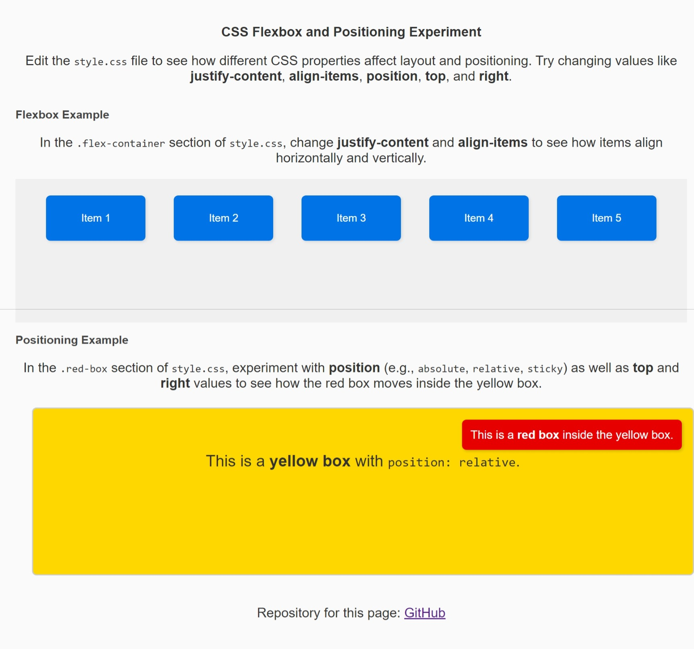

# 🎨 CSS Flexbox & Positioning Experiment


Welcome to the **CSS Flexbox & Positioning Experiment**! This project is a hands-on way to learn and practice using **flexbox** and **positioning** in CSS. Perfect for beginners, this project lets you change values in the CSS file and see how they affect layout and alignment.

📝 **Edit. Save. Refresh.** Each time you make a change, save your work and refresh the browser to see the results instantly!

## 🌐 Live Demo

✨ [**Explore the Live Version on GitHub Pages**](https://lesley-byte.github.io/CssFlexboxPosition/)

## 🔮 Screenshot



## 📂 Project Structure

Here's a quick overview of the files and their purposes:

- **index.html** - The main structure of the page. This is where the content is set up.
- **style.css** - The stylesheet where all the magic happens! Update properties here to see changes.
- **assets/** - A folder to organize stylesheets, images, or other assets if you expand the project.

## 🌟 Getting Started

1. **Fork** and **clone** the repository to your computer.
2. **Open** `index.html` in your favorite browser to see the current layout.
3. **Edit** `style.css` in a text editor and save changes to experiment with different layouts and alignments.

## 🔥 What You’ll Learn

In this project, you’ll explore:

- **Flexbox Properties**: Adjust `justify-content` and `align-items` in the `.flex-container` to align items in different ways.
- **Positioning**: Change `position`, `top`, and `right` in the `.red-box` to understand how absolute, relative, and sticky positioning work.

## 🧑‍💻 How to Use This Project

Edit values in `style.css` to try different effects. Here are some suggestions:

### Flexbox Section

- Try changing `justify-content` to values like `center`, `space-around`, or `flex-end` to see how items align horizontally.
- Change `align-items` to `stretch`, `center`, or `flex-start` to adjust vertical alignment.

### Positioning Section

- Change `.red-box`'s `position` property to `absolute`, `relative`, or `sticky` to see how the red box behaves within the yellow box.
- Adjust the `top` and `right` properties to move the red box to different positions.

## 📘 Code Overview

Here’s a breakdown of the primary CSS classes:

- **.flex-container**: This is the main container where flex properties like `justify-content` and `align-items` control the layout of the items inside.
- **.flex-item**: Individual items within the flex container. Each item can be aligned or spaced using properties in the container.
- **.yellow-box**: A positioned container that holds the red box. This is set to `position: relative;`, so items inside can be positioned relative to it.
- **.red-box**: The box to experiment with positioning. Adjust properties like `position`, `top`, and `right` to see how it moves within the yellow box.

## 🎨 Example Changes

Try making these updates to see how they change the layout:

```css
.flex-container {
  justify-content: center; /* Centers items in the flexbox container */
  align-items: stretch; /* Stretches items to fill the height */
}

.red-box {
  position: sticky;
  top: 10px;
  right: auto; /* Removes right alignment */
}
```

## 💡 Tips for Beginners

- **Play with Values**: Don’t hesitate to try different values for properties. Experimentation is key to learning!
- **Use Developer Tools**: Open your browser's developer tools (usually F12) to inspect elements and see how changes affect the layout in real-time.
- **Observe Changes**: Use the "Edit. Save. Refresh." method to see how each change impacts the layout in real-time.
- **Google is Your Friend**: If you're unsure about a property or value, a quick search can provide helpful explanations and examples.

## 🤝 Contributing

Feel free to contribute by forking the repository and submitting a pull request with your changes. We welcome improvements, additional examples, or any other enhancements!

## 📄 License

This project is licensed under the MIT License - see the [LICENSE](LICENSE) file for details.

```markdown
Happy coding! 🎉
```
